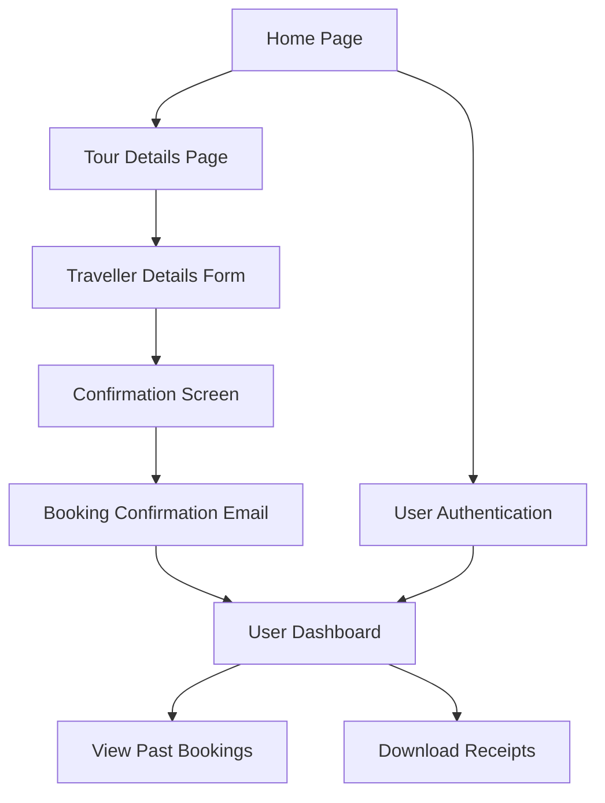

# **Safar Karo: Travel Website**  

*Dream | Explore | Discover*  

---

## **Overview**  
**Safar Karo** is a modern travel booking platform designed to transform how people explore the world. Our mission is simple: to inspire travelers to dream big, explore new horizons, and discover the beauty of domestic and international destinations.  

This project seamlessly combines **ReactJS** for an intuitive frontend with the robust backend capabilities of **Django REST Framework**, offering a dynamic and user-friendly experience.  

With **Safar Karo**, users can:  
- Browse meticulously crafted travel packages.  
- View all essential details, from itineraries to prices, before making an informed choice.  
- Enjoy a smooth booking process that includes traveler details and receipt generation.  
- Access a personalized dashboard to manage past bookings and download receipts.  

Embark on your journey with **Safar Karo** and let your adventures begin!  

---

## **Table of Contents**  
1. [Overview](#overview)  
2. [Video Demo](#video-demo)  
3. [Features](#features)  
4. [Screenshots](#screenshots)  
5. [Technologies](#technologies)  
6. [Setup Instructions](#setup-instructions)  
7. [Mermaid Diagram](#mermaid-diagram)  

---

## **Video Demo**  
🎥 Watch the project in action:  

- [Safar Karo Demo 1](https://via.placeholder.com/150?text=Demo+1)  
- [Safar Karo Demo 2](https://via.placeholder.com/150?text=Demo+2)  

---

## **Features**  

- **Home Page**  
  - Discover top destinations with user testimonials for added trust.  

- **Detailed Tour Pages**  
  - View tour-specific information such as itineraries, travel dates, prices, and terms & conditions.  

- **Booking Process**  
  - Complete the booking in a few simple steps, including filling in traveler details and confirming.  
  - Receive an automated confirmation email with booking details and a receipt.  

- **User Authentication & Dashboard**  
  - Sign up and log in to manage your travel plans.  
  - View your booking history and download receipts anytime.  

---

## **Screenshots**  

### 1. **Home Page**  
Explore curated domestic and international destinations.  

  

### 2. **Tour Details Page**  
Get all the details about your chosen destination.  

  

### 3. **Traveller Details Form**  
Fill in traveler information for your booking.  

  

### 4. **User Dashboard**  
Manage your bookings and download receipts.  

  

---

## **Technologies**  

### **Frontend**  
- ReactJS  
- HTML5, CSS3, Bootstrap  

### **Backend**  
- Python (Django & Django REST Framework)  

### **Database**  
- SQLite  

---

## **Setup Instructions**  

### **Clone the Repository**  
```bash
git clone https://github.com/yourusername/safarkaro.git
cd safarkaro
```
### **Backend Setup**
```bash
cd backend
pip install -r requirements.txt
python manage.py migrate
python manage.py runserver
```
### **Frontend Setup**
```bash
cd frontend
npm install
npm start
```

### **Access the Application**
   • Frontend: http://localhost:3000 <br> 
   • Backend: http://localhost:8000

### **Mermaid Diagram**



